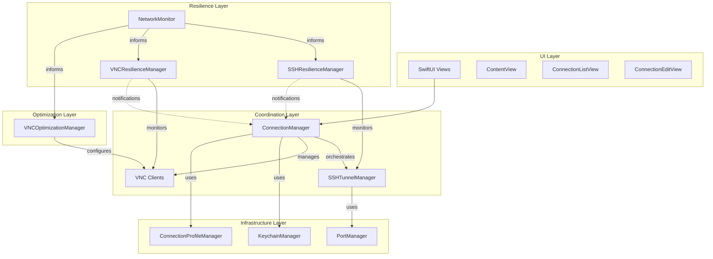
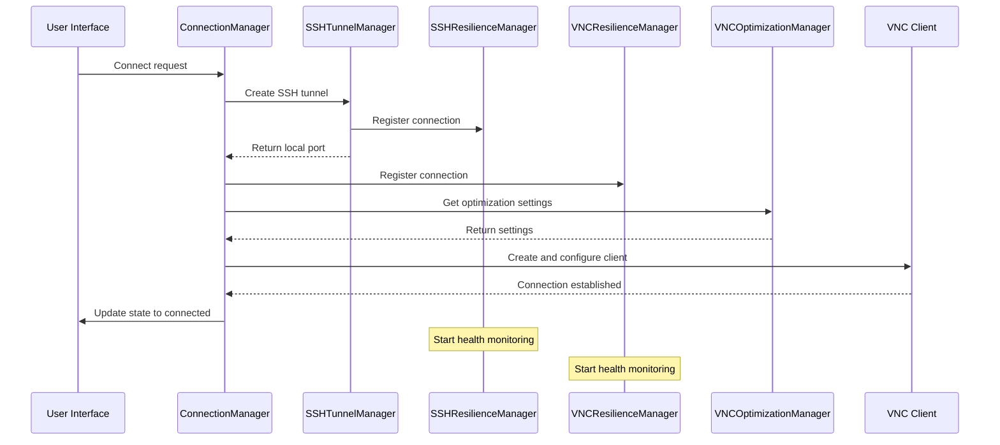
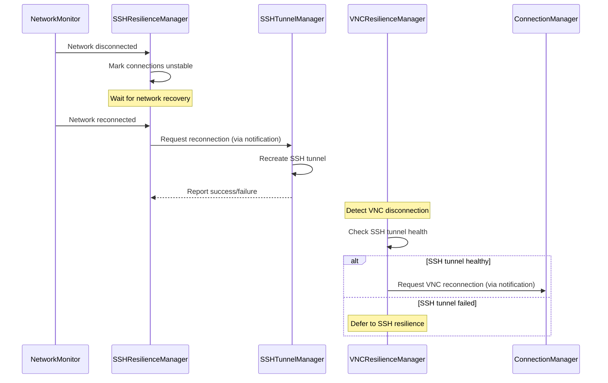

# VirtualControlRoom Architecture Design - Sprint 3

## System Overview

VirtualControlRoom is a visionOS application that provides secure VNC connections through SSH tunnels with comprehensive resilience and optimization features. The architecture follows a modular design with clear separation of concerns and independent resilience managers.

## Core Architecture Pattern



## Component Responsibilities

### 1. ConnectionManager - Central Orchestrator

**Role**: Primary state machine for VNC connection lifecycle

**State Management**:
```swift
enum ConnectionLifecycleState {
    case idle
    case connecting
    case connected
    case windowOpen
    case disconnecting
    case windowClosed
}
```

**Key Responsibilities**:
- VNC client creation and lifecycle management
- UI state coordination (`@Published` properties)
- SSH tunnel coordination
- Window lifecycle management
- User interaction handling

**Integration Points**:
- Creates VNC clients with `LibVNCClient`
- Requests SSH tunnels from `SSHTunnelManager`
- Responds to resilience notifications
- Manages connection profiles via `ConnectionProfileManager`

### 2. SSHTunnelManager - SSH Tunnel Orchestration

**Role**: Manages SSH tunnel creation, lifecycle, and integration

**Key Responsibilities**:
- SSH tunnel creation with dynamic port allocation
- OTP integration for multi-factor authentication
- Tunnel health testing and validation
- Integration with `SSHResilienceManager`
- Resource cleanup and port management

**Data Structures**:
```swift
struct ActiveSSHTunnel {
    let connectionID: String
    let localPort: Int
    let config: SSHConnectionConfig
    let vncHost: String
    let vncPort: Int
}
```

**Integration Points**:
- Uses `PortManager` for dynamic port allocation
- Registers connections with `SSHResilienceManager`
- Handles reconnection requests via notifications

### 3. SSHResilienceManager - SSH Health & Recovery

**Role**: Independent SSH connection monitoring and auto-reconnection

**Health Monitoring**:
- Periodic health checks (30-second intervals)
- Network change detection and adaptation
- Timeout management and connection validation

**Auto-Reconnection Logic**:
- Maximum 3 reconnection attempts
- 5-second delay between attempts
- Exponential backoff for failures

**State Management**:
```swift
enum SSHConnectionStatus {
    case connecting
    case connected
    case disconnected
    case unstable
    case failed
}
```

**Integration Points**:
- Monitors `NetworkMonitor` for connectivity changes
- Sends reconnection requests to `SSHTunnelManager`
- Maintains independent health state

### 4. VNCResilienceManager - VNC Health & Failover

**Role**: VNC-specific connection monitoring and user experience

**Health Monitoring**:
- VNC client health validation (15-second intervals)
- Connection failure detection and categorization
- User-friendly error message generation

**Failover Logic**:
- Maximum 2 reconnection attempts (less aggressive than SSH)
- 3-second delay between attempts
- Defers to SSH resilience when tunnel is down

**Error Translation**:
- Converts technical VNC errors to user-friendly messages
- Provides actionable guidance for common issues
- Categorizes errors (timeout, refused, authentication, etc.)

### 5. VNCOptimizationManager - Performance Tuning

**Role**: Dynamic VNC performance optimization

**Network Adaptation**:
- Cellular: Conservative settings (Tight encoding, high compression)
- WiFi: Balanced settings (Tight + ZRLE encoding, medium compression)
- Wired: Performance settings (ZRLE + Tight encoding, low compression)

**Optimization Settings**:
```swift
struct VNCOptimizationSettings {
    let preferredEncodings: [VNCEncoding]
    let compressionLevel: Int        // 0-9
    let jpegQuality: Int            // 0-9
    let pixelFormat: VNCPixelFormat
    let maxFrameRate: Int
}
```

### 6. NetworkMonitor - Connectivity Intelligence

**Role**: System-wide network state monitoring

**Capabilities**:
- Real-time connectivity detection
- Connection type identification (WiFi, Cellular, Wired)
- Expensive connection detection
- Network change event broadcasting

**Integration**:
- Publishes network change events via Combine
- Informs all resilience and optimization managers
- Triggers adaptive behavior across the system

## Data Flow Architecture

### Connection Establishment Flow



### Resilience and Recovery Flow



## State Synchronization

### Multi-Manager State Coordination

The architecture uses a notification-based approach for state coordination:

```swift
// SSH Resilience → SSH Tunnel Manager
NotificationCenter.default.post(name: .sshReconnectionAttempt, object: connectionID)

// VNC Resilience → Connection Manager  
NotificationCenter.default.post(name: .vncReconnectionAttempt, object: connectionID)

// Optimization → Active Connections
NotificationCenter.default.post(name: .vncOptimizationChanged, object: connectionID)
```

### State Consistency Rules

1. **SSH Failure → VNC Failure**: When SSH tunnel fails, VNC connection should also be marked as failed
2. **VNC Failure + Healthy SSH**: VNC resilience attempts reconnection
3. **Network Change**: All managers adapt settings and validate connections
4. **Resource Cleanup**: Each manager cleans up its own resources

## Architectural Strengths

### 1. Separation of Concerns
- Each manager has a single, well-defined responsibility
- Clear boundaries between SSH, VNC, and optimization concerns
- Independent operation allows for specialized handling

### 2. Resilience Design
- Multi-layer failure detection and recovery
- Network-aware adaptation
- User-friendly error handling

### 3. Performance Optimization
- Dynamic settings based on network conditions
- Comprehensive encoding and compression options
- Adaptive frame rate and quality management

### 4. Modularity
- Loosely coupled components via notifications
- Easy to test individual managers
- Clear extension points for new features

## Current Limitations and Technical Debt

### 1. Incomplete Resource Management
```swift
// SSHTunnelManager.getTunnel() always returns nil
func getTunnel(for connectionID: String) -> SSHTunnel? {
    return activeTunnels[connectionID] != nil ? nil : nil
}
```

### 2. Missing State Coordination
- No central coordinator for cross-manager state
- Potential race conditions in state updates
- No guaranteed state consistency

### 3. Optimization Stub Implementation
- VNC optimization methods are not implemented
- No actual performance monitoring
- Settings changes don't propagate to active connections

### 4. Incomplete Data Structures
```swift
// ActiveSSHTunnel references undefined properties
var config: SSHConnectionConfig  // Not defined in struct
var vncHost: String             // Not defined in struct
```

## Recommended Improvements

### 1. Add Central Coordination
```swift
@MainActor
class ConnectionCoordinator {
    func establishConnection(_ profileID: UUID) async throws
    func handleFailure(_ connectionID: String, type: FailureType)
    func synchronizeStates()
}
```

### 2. Implement State Delegation
```swift
protocol ConnectionStateDelegate {
    func stateChanged(_ connectionID: String, 
                     ssh: SSHConnectionStatus, 
                     vnc: VNCConnectionStatus)
}
```

### 3. Complete Resource Management
- Store actual tunnel references
- Implement proper cleanup chains
- Add resource leak detection

### 4. Performance Integration
- Implement VNC optimization methods in LibVNC wrapper
- Add performance metrics collection
- Create feedback loop for dynamic optimization

## Technology Stack Integration

### SwiftUI Integration
- `@Published` properties for reactive UI updates
- Environment objects for manager injection
- Combine publishers for state observation

### SwiftNIO SSH Integration
- Custom channel handlers for data conversion
- Event loop integration for async operations
- Proper resource cleanup and cancellation

### LibVNC Integration
- Thread-safe client management
- Framebuffer optimization
- Input event handling

### visionOS Integration
- Window lifecycle management
- AR space positioning
- System notification handling

This architecture provides a robust foundation for secure, resilient VNC-over-SSH connections with comprehensive error handling and performance optimization capabilities.