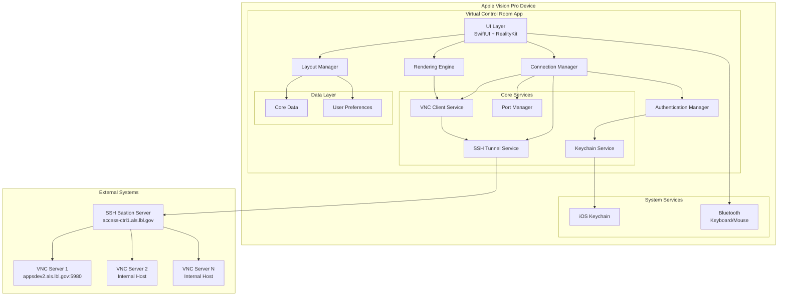
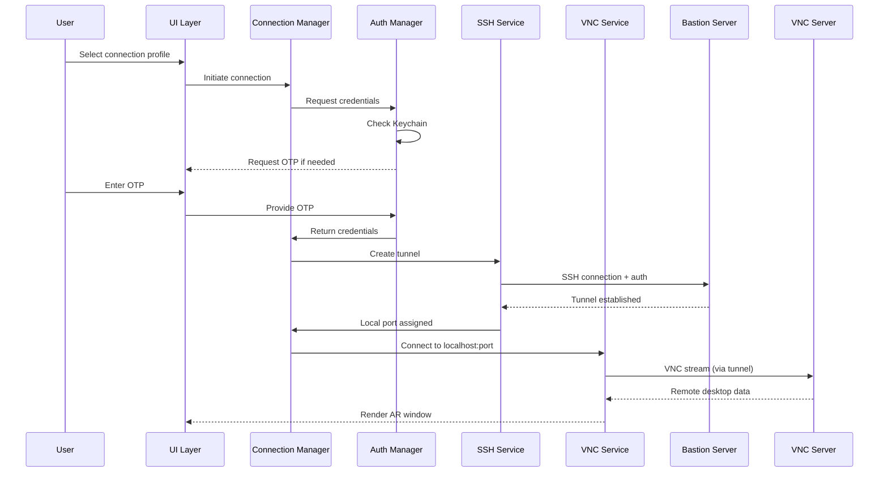
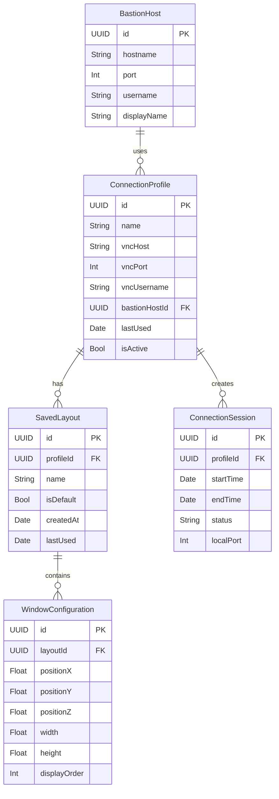

# Virtual Control Room - Application Architecture

## 1. Overall System Design

The Virtual Control Room is a native visionOS application built entirely in Swift. Since this is a client-side application for Apple Vision Pro, there's no traditional backend server. The architecture focuses on managing secure connections, rendering, and local data persistence.

### System Architecture Diagram



### Data Flow Diagram



## 2. Core Services/Modules

### 2.1 UI Layer (SwiftUI + RealityKit)
- **Responsibility**: Manages all user interface components and AR window rendering
- **Key Components**:
  - Connection Profile List View
  - Authentication Dialogs
  - AR Window Manager (using RealityKit)
  - Settings and Preferences Views
  - Status Indicators

### 2.2 Connection Manager
- **Responsibility**: Orchestrates the entire connection lifecycle
- **Key Functions**:
  - Manage multiple concurrent connections
  - Coordinate SSH tunnel creation with VNC connections
  - Handle connection state transitions
  - Clean up resources on disconnect

### 2.3 Authentication Manager
- **Responsibility**: Handle all authentication workflows
- **Key Functions**:
  - Retrieve stored credentials from Keychain
  - Prompt for OTP when needed
  - Cache session credentials (with timeout)
  - Validate credential formats

### 2.4 SSH Tunnel Service
- **Responsibility**: Create and manage SSH tunnels
- **Key Functions**:
  - Establish SSH connections using NMSSH or similar Swift SSH library
  - Set up port forwarding
  - Monitor tunnel health
  - Handle reconnection logic

### 2.5 VNC Client Service
- **Responsibility**: Handle VNC protocol communication
- **Key Functions**:
  - Connect to VNC servers via local tunnels
  - Handle VNC authentication
  - Stream and decode VNC framebuffer data
  - Process input events (keyboard/mouse)

### 2.6 Port Manager
- **Responsibility**: Dynamically allocate local ports for SSH tunnels
- **Key Functions**:
  - Track available ports
  - Assign unique ports to each connection
  - Prevent port conflicts
  - Release ports on disconnect

### 2.7 Layout Manager
- **Responsibility**: Save and restore AR window layouts
- **Key Functions**:
  - Persist window positions and sizes
  - Apply saved layouts on connection
  - Support multiple layout presets
  - Handle layout versioning

### 2.8 Rendering Engine
- **Responsibility**: Convert VNC streams to AR windows
- **Key Functions**:
  - Create RealityKit entities for each remote desktop
  - Update textures with VNC framebuffer data
  - Handle window interactions (resize, move)
  - Optimize rendering performance

## 3. Database Schema (High-Level)



## 4. API Design Considerations

Since this is a client-side application, we're not designing REST APIs but rather internal service interfaces:

### Connection Service Interface
```swift
protocol ConnectionServiceProtocol {
    func connect(profile: ConnectionProfile) async throws -> Connection
    func disconnect(connectionId: UUID) async
    func getActiveConnections() -> [Connection]
    func getConnectionStatus(connectionId: UUID) -> ConnectionStatus
}
```

### Authentication Service Interface
```swift
protocol AuthenticationServiceProtocol {
    func getStoredCredentials(for profile: ConnectionProfile) async -> StoredCredentials?
    func requestOTP(for bastionHost: BastionHost) async -> String
    func saveCredentials(_ credentials: Credentials, for profile: ConnectionProfile) async throws
    func clearSessionCache()
}
```

### Layout Service Interface
```swift
protocol LayoutServiceProtocol {
    func saveCurrentLayout(name: String) async throws
    func loadLayout(_ layout: SavedLayout) async throws
    func getLayouts(for profile: ConnectionProfile) -> [SavedLayout]
    func setDefaultLayout(_ layout: SavedLayout)
}
```

## 5. Scalability and Security Considerations

### Security
1. **Credential Storage**:
   - All credentials stored in iOS Keychain (hardware-encrypted)
   - Implement biometric authentication for accessing stored credentials
   - Session-based credential caching with configurable timeout

2. **Network Security**:
   - All VNC traffic tunneled through SSH
   - Support for SSH key-based authentication (future enhancement)
   - Certificate pinning for known bastion hosts

3. **Application Security**:
   - App Transport Security (ATS) compliance
   - Code obfuscation for sensitive logic
   - Runtime application self-protection (RASP)

### Scalability
1. **Connection Management**:
   - Implement connection pooling for SSH tunnels
   - Lazy loading of VNC streams (only active when window visible)
   - Resource limits (max concurrent connections)

2. **Performance Optimization**:
   - Metal-based rendering for VNC streams
   - Adaptive quality based on network conditions
   - Frame rate limiting for battery optimization

3. **Memory Management**:
   - Implement aggressive cleanup of inactive connections
   - Stream-based processing of VNC data (avoid buffering entire frames)
   - Memory pressure handling

## 6. Technology Stack

### Core Technologies
- **Language**: Swift 5.9+
- **UI Framework**: SwiftUI + RealityKit
- **SSH Library**: NMSSH or SwiftNIO SSH
- **VNC Library**: Custom implementation or adapted open-source library
- **Persistence**: Core Data + UserDefaults
- **Security**: iOS Keychain Services
- **Networking**: Network.framework

### Development Tools
- **IDE**: Xcode 15+
- **Version Control**: Git
- **CI/CD**: Xcode Cloud
- **Testing**: XCTest + Reality Composer Pro for AR testing

## 7. Next Steps/Further Breakdown

### Phase 1: Foundation (Weeks 1-2)
1. Set up project structure and dependencies
2. Implement basic SSH tunnel service
3. Create connection profile data model
4. Build Keychain integration

### Phase 2: Core Functionality (Weeks 3-5)
1. Integrate VNC client library
2. Implement Connection Manager
3. Build basic UI for connection management
4. Create authentication flow

### Phase 3: AR Integration (Weeks 6-8)
1. Implement RealityKit-based window rendering
2. Add window management (move, resize)
3. Integrate keyboard/mouse input
4. Build layout persistence

### Phase 4: Polish & Optimization (Weeks 9-10)
1. Implement error handling and recovery
2. Add connection status indicators
3. Optimize performance
4. Conduct security audit

### Phase 5: Testing & Release (Weeks 11-12)
1. Comprehensive testing
2. Beta testing with users
3. Documentation
4. App Store submission

## Development Epics

1. **Epic: Secure Connection Infrastructure**
   - SSH tunnel implementation
   - Port management system
   - Connection lifecycle management

2. **Epic: Authentication System**
   - Keychain integration
   - OTP input flow
   - Credential caching

3. **Epic: VNC Integration**
   - VNC client library integration
   - Stream processing
   - Input event handling

4. **Epic: AR Window System**
   - RealityKit window rendering
   - Window management gestures
   - Layout persistence

5. **Epic: User Experience**
   - Connection profile management
   - Status indicators
   - Error handling
   - Settings and preferences 